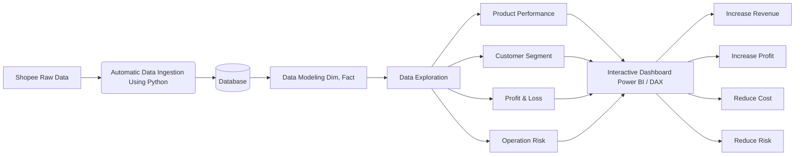
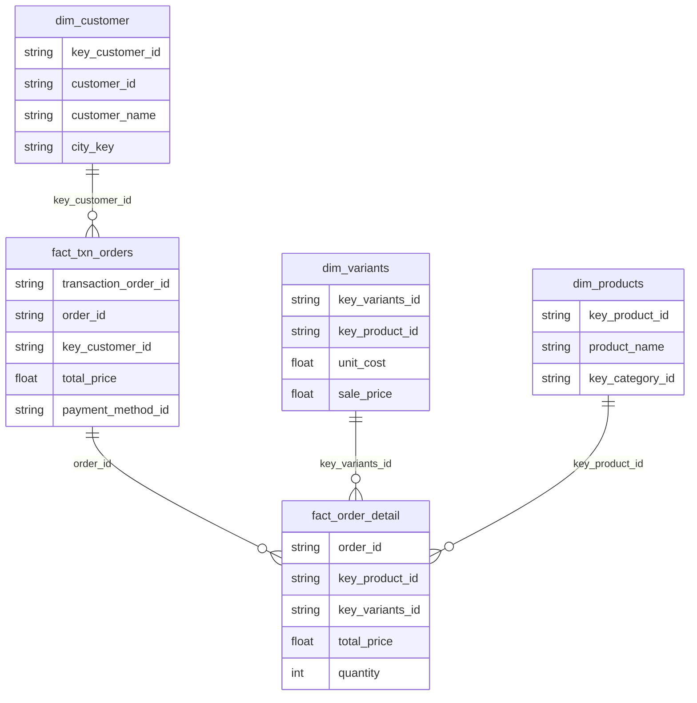

# Doonie Watch Data Analysis
Note: All metrics, data structures, and reporting frameworks belonging to the Doonie Watch brand have been authorized for public professional presentation via written consent by the business owner.

## 1. Background and Overview
- **Business Context:** Retained as an independent data consultant (outsource) by the owner of Doonie Watch during a phase of rapid growth on Shopee. The business faced a critical 'raw data crisis': cash flow transparency was obscured, operational overhead (particularly ad spend) was soaring, and order cancellations spiked at 24.06% due to fragmented, unstructured data exported from the e-commerce platform.
- **Goal:** Restructured the data storage environment into a centralized relational system, transforming raw files into a suite of 4 automated management dashboards. This enabled the executive team to make precise, immediate strategic interventions.

## 2. Data Structure

### Data Flowchart
The following flowchart illustrates the data pipeline from raw Shopee data to the final Power BI dashboards used for business decisions:

### Database Diagram
The data modeling follows a Star Schema approach. Below is the simplified Entity-Relationship diagram highlighting the core tables used in our analysis:

## 3. Executive Summary
Based on the latest data (analyzed for May 2026), the business is performing excellently with an overall health score of **82.00**.

**Key highlights:**
- **Revenue & Profitability:** Total Revenue reached 31.32M VND (a 7.2% increase from the previous month). The net profit margin is remarkably strong at 21.8%, generating 6.8M VND in net profit, indicating highly efficient cost management despite high advertising fees (which make up 64.29% of operating expenses).
- **Customer Base:** Reached 1969 total historical customers, with 116 new customers acquired this month. The Average Order Value (AOV) is a healthy 331,642 VND.
- **Conversion:** Product views stand at 143.8K with a strong conversion rate of 2.00%, meaning traffic quality and purchase intent are highly efficient.
- **Areas of Concern:** The cancellation rate is notably high at 24.06% (32 canceled orders out of 133 total orders), which is a significant operational risk factor that needs immediate attention.

## 4. Insight Deep Dive

**Insight 1: High Cancellation Rate Driven by Specific Payment Methods**
- **Quantified Value:** 24.06% overall cancellation rate; with Cash on Delivery (COD) accounting for a staggering 17.29% cancellation rate.
- **Business Metric:** Cancellation Rate, Risk Score.
- **Simple Story:** While sales are growing, almost a quarter of all orders are being canceled. A deeper look into the risk dashboard reveals that COD (Thanh toán khi nhận hàng) is the primary driver. Customers might be placing impulsive orders and canceling them before shipment or simply refusing them upon delivery.

**Insight 2: Ad Spend Dominates Operating Expenses**
- **Quantified Value:** Ads fee accounts for 64.29% of the total operating expense structure.
- **Business Metric:** Operating Expense Breakdown, Net Profit Margin.
- **Simple Story:** The business is heavily reliant on paid advertising to drive its 143K product views and acquire 116 new customers. While this strategy is currently yielding a solid 2.0% conversion rate and a 21.8% profit margin, any future increase in ad costs or drop in ad efficiency could severely impact the bottom line.

**Insight 3: Luxury Watches Drive Views, But Fashion Pays the Bills**
- **Quantified Value:** Luxury watches account for 45.03% (64.77K) of all views, followed by fashion watches (35.85%).
- **Business Metric:** Product Views by Category, CTR.
- **Simple Story:** Customers are highly attracted to the luxury segment, making it the primary traffic magnet for the shop. However, top-performing brands by actual order volume include DW, Movado, and Casio. This suggests luxury items act as "window shopping" bait, drawing users in before they ultimately purchase more affordable or fashion-oriented models.

**Insight 4: Strong Reliance on the Ho Chi Minh City Market**
- **Quantified Value:** Ho Chi Minh City generated the highest customer volume (43 customers), significantly outpacing other provinces like Dong Nai (13).
- **Business Metric:** Customer Acquisition by Location.
- **Simple Story:** The customer base is heavily concentrated in major urban areas, specifically HCMC. While this reduces shipping complexities and transit times, it also indicates an untapped market potential in other tier-2 cities where the brand hasn't fully penetrated.

**Insight 5: Low Customer Retention Rate**
- **Quantified Value:** Only 10.08% of the customer base are returning customers (13 returning vs 116 new this month).
- **Business Metric:** Customer Retention Rate, Customer Base Segmentation.
- **Simple Story:** The shop is excellent at acquiring new buyers (thanks to high ad spend), but struggles to bring them back for a second purchase. For watches, the buying cycle might be long, but a ~10% retention rate suggests missing out on cross-selling opportunities like straps, accessories, or gifts.

## 5. Recommendations

1. **Implement COD Verification:** Since COD drives the majority of the 24.06% cancellation rate, implement a pre-shipping verification step (like an automated Shopee chat message or a quick call) to confirm orders before dispatch. This will save on failed shipping and packaging costs.
2. **Optimize Ad Spend Towards Retention:** Shift a small portion of the massive 64% ads budget towards retargeting existing customers. Promoting accessories, replacement straps, or offering a loyalty discount can drastically improve the low 10.08% retention rate.
3. **Expand Regional Marketing:** With HCMC dominating sales, run localized geo-targeted campaigns for neighboring provinces (like Dong Nai, Binh Duong, and Can Tho) to diversify the customer base and capture new market share.
4. **Bundle Offers to Leverage Luxury Traffic:** Since luxury watches drive 45% of views but aren't the sole revenue source, introduce bundled products (e.g., buy a luxury watch and get a discounted strap, or bundle a fashion watch for gifting). This capitalizes on the high traffic to push actual sales.
