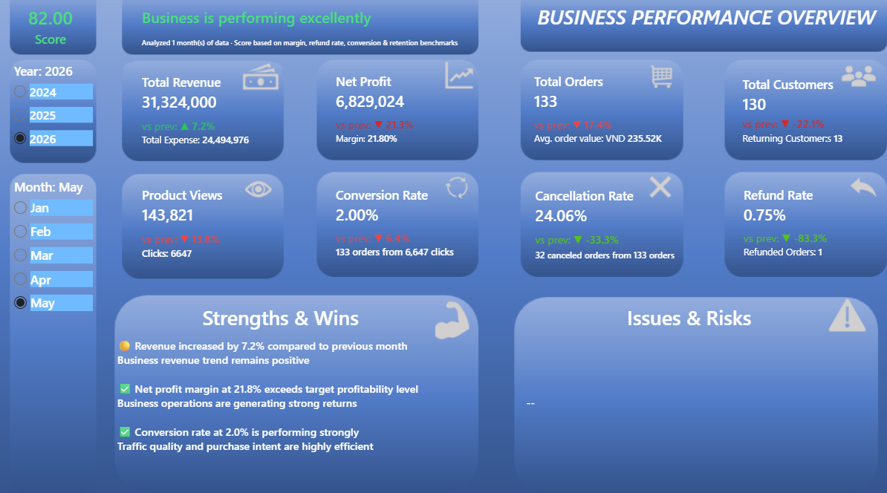
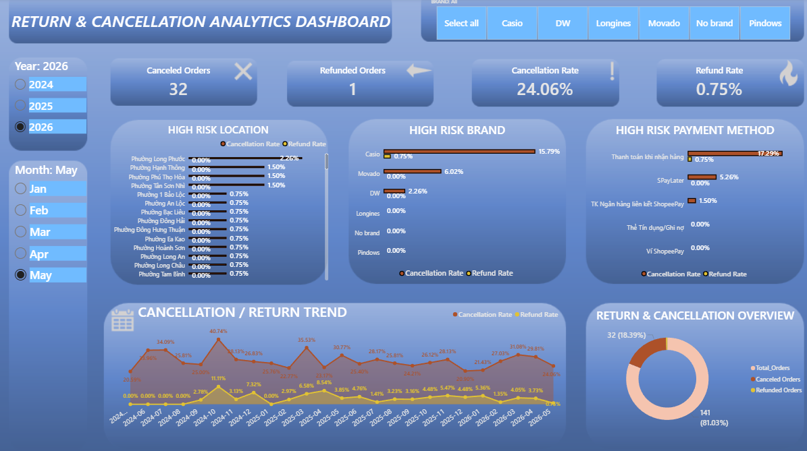
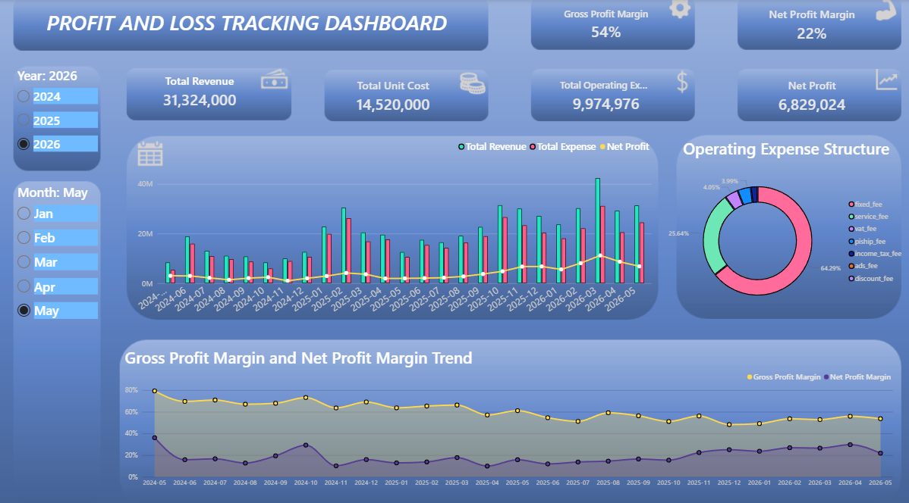
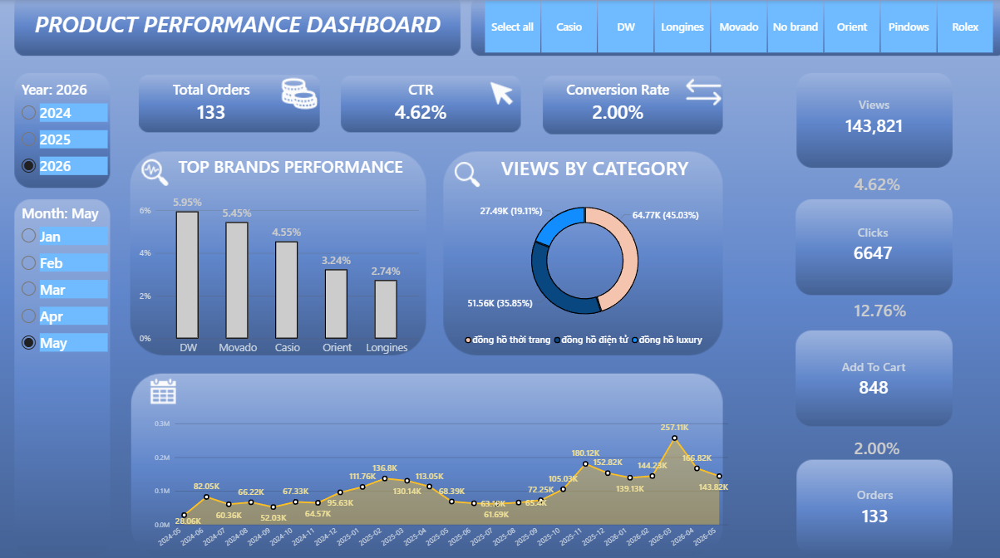
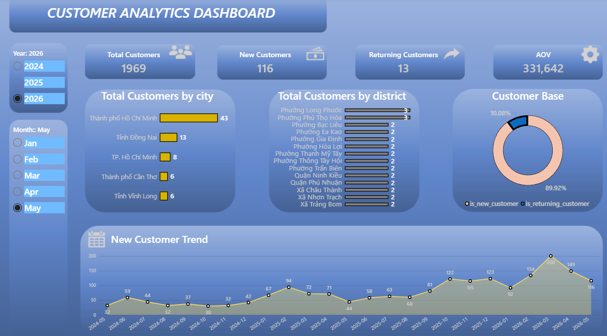

# Doonie Watch Data Analysis

> **Note:** All metrics, data structures, and reporting frameworks belonging to the Doonie Watch brand have been authorized for public professional presentation via written consent by the business owner.

---

# 1. Background and Overview

- **Business Context:** Retained as an independent data consultant (outsource) by the owner of Doonie Watch during a phase of rapid growth on Shopee. The business faced a critical "raw data crisis": cash flow transparency was obscured, operational inefficiencies increased, and order cancellations spiked at 24.06% due to fragmented, unstructured data exported from the e-commerce platform.

- **Goal:** Restructured the data storage environment into a centralized relational system, transforming raw files into a suite of 4 automated management dashboards. This enabled the executive team to make precise, immediate strategic interventions.

---

# 2. Data Structure

## Data Flowchart

The following flowchart illustrates the data pipeline from raw Shopee data to the final Power BI dashboards used for business decisions:

```mermaid
graph LR
    A[Shopee Raw Data] --> B(Automatic Data Ingestion Using Python)

    B --> C[(Database)]

    C --> D[Data Modeling Dim, Fact]

    D --> E[Data Exploration]

    E --> E1[Product Performance]
    E --> E2[Customer Segment]
    E --> E3[Profit & Loss]
    E --> E4[Operation Risk]

    E1 --> F[Interactive Dashboard Power BI / DAX]
    E2 --> F[Interactive Dashboard Power BI / DAX]
    E3 --> F[Interactive Dashboard Power BI / DAX]
    E4 --> F[Interactive Dashboard Power BI / DAX]

    F --> G1[Increase Revenue]
    F --> G2[Increase Profit]
    F --> G3[Reduce Cost]
    F --> G4[Reduce Risk]
````

## Database Diagram

The data modeling follows a Star Schema approach. Below is the simplified Entity-Relationship diagram highlighting the core tables used in our analysis:

```mermaid
erDiagram
    dim_customer ||--o{ fact_txn_orders : "key_customer_id"

    fact_txn_orders ||--o{ fact_order_detail : "order_id"

    dim_variants ||--o{ fact_order_detail : "key_variants_id"

    dim_products ||--o{ fact_order_detail : "key_product_id"

    dim_customer {
        string key_customer_id
        string customer_id
        string customer_name
        string city_key
    }

    fact_txn_orders {
        string transaction_order_id
        string order_id
        string key_customer_id
        float total_price
        string payment_method_id
    }

    fact_order_detail {
        string order_id
        string key_product_id
        string key_variants_id
        float total_price
        int quantity
    }

    dim_variants {
        string key_variants_id
        string key_product_id
        float unit_cost
        float sale_price
    }

    dim_products {
        string key_product_id
        string product_name
        string key_category_id
    }
```

---

# 3. Executive Summary

Based on the latest data (analyzed for May 2026), the business is performing strongly with an overall health score of **82.00**.

## Key Highlights

* **Revenue & Profitability:** Total Revenue reached **31.32M VND** (a 7.2% increase from the previous month). The net profit margin remains strong at **21.8%**, generating **6.8M VND** in net profit, reflecting healthy operational efficiency and sustainable profitability.

* **Customer Base:** Reached **1,969 total historical customers**, with **116 new customers acquired this month**. The Average Order Value (AOV) stands at **331,642 VND**.

* **Conversion Performance:** Product views reached **143.8K** with a strong conversion rate of **2.00%**, indicating high-quality traffic and effective product-market fit.

* **Areas of Concern:** The cancellation rate remains critically high at **24.06%** (32 canceled orders out of 133 total orders), representing the largest operational risk factor for the business.



---

# 4. Insight Deep Dive

## Insight 1: High Cancellation Rate Driven by Specific Payment Methods

* **Quantified Value:** 24.06% overall cancellation rate; with Cash on Delivery (COD) accounting for a significant proportion of canceled orders.

* **Business Metric:** Cancellation Rate, Risk Score.

* **Simple Story:** While sales continue growing, nearly one out of every four orders is canceled. Analysis from the operational risk dashboard shows that COD orders are the primary contributor to failed transactions. This behavior may stem from impulsive purchasing decisions or customers refusing delivery upon receipt.



---

## Insight 2: Strong Profitability Despite Operational Pressure

* **Quantified Value:** Net Profit Margin reached 21.8%, generating approximately 6.8M VND in net profit.

* **Business Metric:** Net Profit Margin, Operating Profit.

* **Simple Story:** Despite operational challenges such as cancellations and logistics-related inefficiencies, the business still maintains a healthy profit structure. This indicates that pricing strategy, product positioning, and order value are currently optimized effectively.



---

## Insight 3: Fashion and Digital Watches Dominate Customer Attention

* **Quantified Value:** Fashion watches account for the largest share of product views, followed closely by digital watches, making them the two most viewed categories on the platform.

* **Business Metric:** Product Views by Category, CTR.

* **Simple Story:** Customer browsing behavior clearly shows that affordable and trendy watch categories attract the majority of traffic. Fashion watches appeal strongly to style-focused buyers, while digital watches benefit from practicality and younger audience demand. These two categories currently act as the primary traffic drivers for the store.



---

## Insight 4: Strong Reliance on the Ho Chi Minh City Market

* **Quantified Value:** Ho Chi Minh City generated the highest customer volume (43 customers), significantly outpacing other provinces like Dong Nai (13).

* **Business Metric:** Customer Acquisition by Location.

* **Simple Story:** The customer base is heavily concentrated in major urban areas, particularly Ho Chi Minh City. While this simplifies logistics and delivery operations, it also reveals untapped growth opportunities in tier-2 provinces where brand penetration remains relatively low.



---

## Insight 5: Low Customer Retention Rate

* **Quantified Value:** Only 10.08% of the customer base are returning customers (13 returning vs 116 new this month).

* **Business Metric:** Customer Retention Rate, Customer Base Segmentation.

* **Simple Story:** The business performs well in attracting new buyers but struggles to convert them into repeat customers. Considering the relatively long replacement cycle of watches, the low retention rate suggests untapped opportunities in accessories, gifting campaigns, and customer loyalty programs.


---

# 5. Recommendations

1. **Implement COD Verification:** Since COD orders contribute heavily to cancellations, introduce a pre-shipping confirmation step (automated Shopee chat or manual verification call) before dispatching orders.

2. **Improve Customer Retention Strategy:** Build retention-focused campaigns such as loyalty discounts, accessory upselling, birthday vouchers, or post-purchase engagement to improve the current 10.08% retention rate.

3. **Expand Regional Marketing:** With HCMC dominating sales, launch localized campaigns targeting neighboring provinces such as Dong Nai, Binh Duong, and Can Tho to diversify the customer base.

4. **Prioritize High-Traffic Categories:** Since fashion and digital watches attract the largest share of views, prioritize inventory allocation, homepage placement, and promotional activities around these categories to maximize conversion opportunities.

```
```
